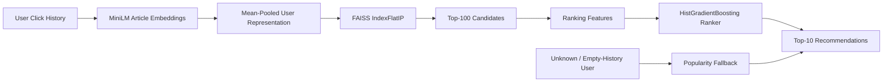

# Personalized News Ranking Engine

An end-to-end personalized news recommendation system built on the
Microsoft MIND dataset, combining semantic candidate retrieval, learned
reranking, cold-start handling, scalable preprocessing, and optimized
low-latency serving.

The project focuses on the full Applied ML lifecycle rather than only
offline model training: chronological evaluation, representation
experiments, two-stage ranking, failure analysis, API serving, load
testing, inference profiling, and scalability validation.

## Architecture



### Stage 1 — Candidate Retrieval

Article titles are encoded once using the frozen
`all-MiniLM-L6-v2` sentence encoder into normalized 384-dimensional
embeddings.

A user representation is formed by mean-pooling the embeddings of
articles in the user's click history. FAISS `IndexFlatIP` performs exact
cosine-similarity retrieval over the warm article corpus and returns the
Top-100 candidate articles.

### Stage 2 — Learned Reranking

The retrieved candidates are scored using a
`HistGradientBoostingClassifier` with five features:

- semantic similarity
- category affinity
- subcategory affinity
- historical click popularity
- user history length

The highest-scoring 10 articles are returned.

Unknown users or users without usable history receive a popularity-based
fallback.

## Dataset

Model development and evaluation use **MINDsmall** with a chronological
split:

| Split                    | Impressions |
| ------------------------ | ----------: |
| Training: Nov 9–13, 2019 |     126,695 |
| Validation: Nov 14, 2019 |      30,270 |

MINDlarge is used separately for preprocessing scalability validation.

## Results

### Candidate Retrieval

Retrieval is evaluated against warm clicked articles over a corpus of
47,538 articles.

| Retriever             |  Recall@50 | Recall@100 |
| --------------------- | ---------: | ---------: |
| Global popularity     |     0.0097 |     0.0138 |
| Frozen MiniLM + FAISS | **0.0168** | **0.0279** |

Semantic retrieval improves Recall@100 by approximately **2×** over
global popularity.

A retrieval-depth analysis showed that relevant articles were often
present deeper in the ranking:

|    K | Recall@K |
| ---: | -------: |
|   50 |   0.0168 |
|  100 |   0.0279 |
|  200 |   0.0437 |
|  500 |   0.0799 |
| 1000 |   0.1220 |

### Learned Reranking

End-to-end ranking over retrieved candidates:

| Model                    |        MRR |     nDCG@5 |    nDCG@10 |
| ------------------------ | ---------: | ---------: | ---------: |
| FAISS similarity         |     0.0038 |     0.0030 |     0.0039 |
| FAISS + learned reranker | **0.0044** | **0.0039** | **0.0047** |

The reranker improved end-to-end nDCG@10 by approximately **20.5%**.

Conditional on FAISS retrieving at least one relevant article:

| Model            |        MRR |     nDCG@5 |    nDCG@10 |
| ---------------- | ---------: | ---------: | ---------: |
| FAISS similarity |     0.0964 |     0.0752 |     0.0979 |
| FAISS + reranker | **0.1114** | **0.0997** | **0.1184** |

This confirms that Stage 2 improves ordering quality when Stage 1 finds
relevant content.

## Cold-Start Evaluation

For validation impressions containing clicked articles unseen during
training, content representations substantially outperformed behavioral
popularity:

| Method             |        MRR |     nDCG@5 |    nDCG@10 |
| ------------------ | ---------: | ---------: | ---------: |
| Popularity         |     0.3556 |     0.3911 |     0.4563 |
| Content similarity | **0.4653** | **0.5185** | **0.5679** |

Content-based ranking improved cold-start nDCG@10 by **24.5%** and MRR
by **30.8%**.

This is a logged-candidate cold-start experiment and is not directly
comparable to corpus-level retrieval metrics.

## Representation Experiments

Several targeted experiments were evaluated after identifying candidate
retrieval as the primary quality bottleneck.

| Experiment               | Recall@100 | Result                            |
| ------------------------ | ---------: | --------------------------------- |
| Title-only mean pooling  | **0.0279** | Production baseline               |
| Multi-interest retrieval |     0.0309 | +10.4%, but ~6× retrieval latency |
| Recency-weighted pooling |     0.0280 | No material improvement           |
| Title + abstract         |     0.0267 | -4.3%, rejected                   |
| Click-adapted encoder    |     0.0109 | -60.9%, rejected                  |

The multi-interest approach improved retrieval quality but increased p95
retrieval latency from roughly 3.3 ms to 19.7 ms. The simpler
single-query title-only representation was therefore retained for its
quality/latency tradeoff.

The click-adapted encoder was also rejected after downstream evaluation
showed that lower training loss did not translate into improved
retrieval quality.

## Model Serving

The final system is exposed through FastAPI:

```text
GET /recommend/{user_id}
```

Known users receive personalized recommendations. Unknown or
empty-history users receive a popularity fallback.

Start the optimized server with:

```bash
./scripts/run_server.sh
```

Example:

```bash
curl http://127.0.0.1:8000/recommend/U65916
```

## Inference Optimization

Initial load testing exposed severe tail-latency degradation under
concurrent requests.

Profiling showed approximately **5.6 ms mean internal recommendation
compute time**, with ranker inference as the largest individual stage.

Native OpenMP/BLAS thread oversubscription was reduced by limiting each
process to one numerical thread.

At concurrency 10:

| Metric      |  Baseline |      Optimized |
| ----------- | --------: | -------------: |
| Throughput  | 50.23 RPS | **207.69 RPS** |
| p95 latency | 317.13 ms |   **65.87 ms** |
| p99 latency | 540.82 ms |   **87.16 ms** |

Peak throughput increased from **58.72 to 219.30 RPS (~3.7×)**.

No requests failed in either benchmark.

See [`docs/serving.md`](docs/serving.md) for the full serving analysis.

## Scaling

Chunked preprocessing was evaluated on both MINDsmall and MINDlarge.

| Dataset   | Impressions | Candidate Interactions | Runtime | Throughput | Peak RSS |
| --------- | ----------: | ---------------------: | ------: | ---------: | -------: |
| MINDsmall |     156,965 |                  5.84M |  6.34 s |  920,980/s |   573 MB |
| MINDlarge |   2,232,748 |                 83.51M | 93.42 s |  893,859/s |   588 MB |

The pipeline processed **83.5M candidate interactions in 93.4 seconds**
while maintaining approximately **894K interactions/sec** and less than
600 MB peak process memory.

PySpark was intentionally not introduced because local chunked
processing remained fast and memory-bounded at full MINDlarge scale.

See [`docs/scaling.md`](docs/scaling.md) for details.

## Testing

The repository contains unit and contract tests covering:

- chronological splitting
- ranking metrics
- baseline ranking
- user/article representations
- FAISS retrieval
- ranking features
- serving response contracts

Run:

```bash
python -m pytest -v
```

Current result:

```text
44 passed
```

## Project Structure

```text
personalized_news_recommender/
├── artifacts/
│   └── metrics/
├── docs/
│   ├── serving.md
│   └── scaling.md
├── scripts/
│   ├── benchmark_api.py
│   ├── benchmark_preprocessing.py
│   ├── profile_serving.py
│   ├── run_baselines.py
│   ├── run_cold_start.py
│   ├── run_multi_interest_retrieval.py
│   ├── run_recency_weighted_retrieval.py
│   ├── run_reranking.py
│   ├── run_retrieval.py
│   ├── run_retrieval_sweep.py
│   ├── run_server.sh
│   ├── train_encoder.py
│   └── train_ranker.py
├── src/
│   ├── data/
│   ├── evaluation/
│   ├── ranking/
│   ├── retrieval/
│   └── serving/
└── tests/
```

## Key Design Decisions

**Chronological evaluation.** Validation occurs strictly after training
data to reduce temporal leakage.

**Exact FAISS search.** With approximately 47K warm articles,
`IndexFlatIP` already provides low-millisecond retrieval, so approximate
ANN indexes were not justified.

**Frozen encoder retained.** Lightweight click adaptation reduced
Recall@100 substantially, so the pretrained encoder was retained.

**Title-only representation retained.** Adding abstracts reduced
retrieval quality.

**No PySpark.** Full MINDlarge preprocessing remained efficient using
bounded-memory Pandas chunks.

**Single-query retrieval retained.** Multi-interest querying increased
Recall@100 but imposed a disproportionate latency cost.

## Limitations

The primary remaining modeling limitation is candidate retrieval recall.
Recall@100 remains 2.79%, which constrains downstream ranking quality
because the reranker cannot recover relevant articles absent from its
candidate set.

The retrieval-depth experiment indicates that many relevant articles
exist deeper in the semantic ranking, suggesting that future work should
focus on learned retrieval representations or stronger user-interest
modeling rather than additional ranker complexity.

The current API is a portfolio-scale production-style prototype rather
than a horizontally distributed recommendation service.
